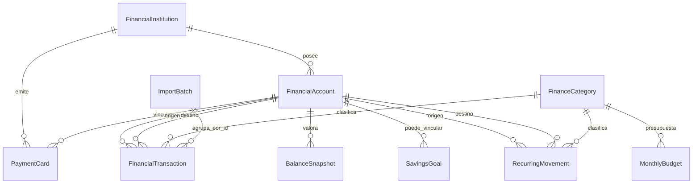
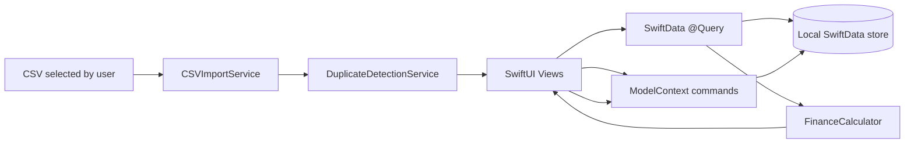

# Mi Patrimonio — especificación funcional y técnica

**Plataforma:** iPhone, aplicación nativa en Swift y SwiftUI  
**Persistencia inicial:** SwiftData, exclusivamente local  
**Versión del documento:** 1.0  
**Fecha de referencia:** 16 de julio de 2026  
**Fuente funcional:** `Control_financiero_3_bancos(3).xlsx`

## Resumen ejecutivo

La aplicación propuesta no se plantea como un diario de gastos aislado, sino como un sistema personal de posición financiera. Su pregunta principal es **«¿cuánto dinero tengo, dónde está y cómo está evolucionando?»**. A partir de esa posición consolidada, la app explica cuánto se ingresa, cuánto se gasta, cuánto se ahorra, qué objetivos avanzan y qué partidas se desvían del presupuesto.

El Excel adjunto ya resuelve bien cuatro conceptos esenciales: saldo consolidado, transferencias internas neutras, presupuesto mensual y resumen de ahorro. El MVP conserva esa lógica, pero sustituye las listas y rangos fijos por entidades configurables, añade historial de patrimonio, valoraciones de inversiones, objetivos, periódicos, importaciones revisables y detección de duplicados.

El proyecto incluido en esta entrega abre como una aplicación iOS de Xcode. Arranca con los datos del Excel como carga inicial, funciona sin red, permite operaciones manuales, importa CSV, muestra gráficos con Swift Charts y protege el acceso mediante la autenticación del dispositivo.

---

# 0. Análisis del Excel adjunto

## 0.1 Estructura encontrada

| Hoja | Rango utilizado | Función actual |
|---|---:|---|
| Dashboard | A1:H25 | Indicadores, saldos, presupuesto y gráficos |
| Movimientos | A1:K1005 | Registro de operaciones y transferencias |
| Cuentas | A1:K22 | Maestro de cuentas, saldo calculado, TAE y objetivos |
| Presupuesto | A1:F21 | Presupuesto mensual por categoría |
| Resumen mensual | A1:E15 | Ingresos, gastos y ahorro por mes |
| Listas | A1:F61 | Catálogos de cuentas, tipos, categorías y meses |

La fecha seleccionada en el cuadro de mando es **julio de 2026**.

## 0.2 Posición financiera inicial

El patrimonio mostrado por el Excel es **2.040,66 €**, repartido de esta manera:

| Entidad y cuenta | Tipo interpretado | Saldo | TAE | Objetivo | Desviación |
|---|---|---:|---:|---:|---:|
| Bankinter — Nómina | Cuenta corriente | 850,00 € | 2,50 % | 2.500,00 € | −1.650,00 € |
| Trade Republic — Ahorro | Cuenta de ahorro | 650,00 € | 3,00 % | 1.000,00 € | −350,00 € |
| BBVA — Cuenta joven | Cuenta corriente | 540,66 € | 0,00 % | 500,00 € | +40,66 € |

El saldo inicial de BBVA es 2.040,66 €. El 15 de julio de 2026 se registran dos transferencias internas:

- 850,00 € de BBVA a Bankinter.
- 650,00 € de BBVA a Trade Republic.

El resultado es correcto: las transferencias reducen una cuenta y aumentan otra, pero **no modifican el patrimonio ni aparecen como ingreso o gasto**.

## 0.3 Presupuesto existente

El presupuesto total de julio asciende a **900,00 €**:

| Categoría | Presupuesto |
|---|---:|
| Restaurantes | 200,00 € |
| Combustible | 150,00 € |
| Ocio | 300,00 € |
| Gimnasio y salud | 50,00 € |
| Ropa y compras | 100,00 € |
| Otros | 100,00 € |

No existen todavía gastos reales en el mes seleccionado, por lo que los ingresos, gastos y ahorro neto de julio figuran a cero. La estimación anual simple de intereses es **40,75 €**: 21,25 € en Bankinter y 19,50 € en Trade Republic.

## 0.4 Reglas que ya implementa correctamente

**Saldo por cuenta**

```text
saldo actual = saldo inicial
             + ingresos e intereses recibidos
             - gastos y comisiones
             - transferencias salientes
             + transferencias entrantes
```

**Resumen mensual**

```text
ingresos = Ingreso + Interés

gastos = Gasto + Comisión

ahorro neto = ingresos - gastos

tasa de ahorro = ahorro neto / ingresos
```

**Patrimonio**

```text
patrimonio = suma de los saldos actuales de las cuentas incluidas
```

## 0.5 Limitaciones detectadas y decisión para la app

| Limitación del Excel | Decisión en la aplicación |
|---|---|
| Máximo práctico de unas 1.000 filas de movimientos | Almacenamiento dinámico en SwiftData |
| Cuentas y categorías dependientes de rangos fijos | Altas, ediciones, archivo y eliminación controlada |
| El gráfico histórico representa flujos, no una serie real de patrimonio | Cálculo mensual del patrimonio y valoraciones puntuales |
| No existe un modelo específico de inversión | Cuenta de inversión más instantáneas de valoración |
| Solo hay un objetivo por cuenta | Entidad independiente `SavingsGoal`, vinculable a una cuenta |
| No hay movimientos periódicos ni suscripciones | Reglas periódicas que generan movimientos revisables |
| No hay trazabilidad de importaciones | Lotes de importación, identificadores externos y checksum |
| No existe detección de duplicados | Huella exacta y coincidencia aproximada |
| Las comisiones no consumen siempre el presupuesto del Excel | En la app, gasto y comisión consumen presupuesto |
| La tasa de ahorro devuelve 0 cuando no hay ingresos | En la app se muestra «—» para evitar una conclusión falsa |
| El interés se calcula como saldo actual × TAE | Se conserva como estimación informativa, no como devengo contable |
| Una tarjeta de débito podría duplicar el saldo de su cuenta | La tarjeta es un medio de pago vinculado; no suma patrimonio |

---

# 1. Diseño de pantallas

## 1.1 Navegación principal

La navegación inferior tiene exactamente cinco destinos:

```text
Inicio · Movimientos · Cuentas · Presupuestos · Ajustes
```

Un botón circular flotante con «+» abre el alta rápida de movimiento desde cualquier pestaña. La interfaz usa componentes del sistema, tipografía Dynamic Type, áreas táctiles amplias y colores que se adaptan a modo claro y oscuro.

## 1.2 Pantalla de bloqueo

**Objetivo:** impedir que el contenido financiero aparezca antes de autenticar al propietario.

```text
┌─────────────────────────────────────┐
│              🔒                     │
│     Mi Patrimonio está bloqueado    │
│                                     │
│ Face ID, Touch ID o código del      │
│ dispositivo                         │
│                                     │
│          [ Desbloquear ]            │
└─────────────────────────────────────┘
```

La app se vuelve a bloquear al pasar a segundo plano. Si el usuario desactiva esta protección en Ajustes, la preferencia se conserva localmente.

## 1.3 Inicio

**Objetivo:** responder en pocos segundos a cuánto se tiene, qué ha ocurrido este mes y qué requiere atención.

```text
┌ Inicio                         👁 ┐
│ Patrimonio total                  │
│ 2.040,66 €                        │
│ Interés neto anual estimado       │
├───────────────────────────────────┤
│ ‹          julio 2026          ›  │
├───────────────────────────────────┤
│ Ingresos │ Gastos │ Ahorro │ Tasa│
├───────────────────────────────────┤
│ Avisos importantes                │
│ • posibles duplicados             │
│ • presupuestos superados          │
│ • reglas periódicas próximas      │
│ • cuentas sin actualizar          │
├───────────────────────────────────┤
│ Saldo por cuenta                  │
├───────────────────────────────────┤
│ Estado de presupuestos            │
├───────────────────────────────────┤
│ Objetivos de ahorro               │
├───────────────────────────────────┤
│ Evolución del patrimonio          │
│ Gastos por categoría              │
│ Presupuesto frente a gasto real   │
└───────────────────────────────────┘
```

El icono de ojo oculta simultáneamente todos los importes. Los porcentajes y gráficos también evitan revelar cifras cuando la preferencia de privacidad está activa; en iteraciones posteriores se puede aplicar un desenfoque completo a los ejes de los gráficos.

## 1.4 Movimientos

La pantalla agrupa operaciones por día y permite buscar en descripción, notas, cuenta, categoría y tipo. Los filtros cubren cuenta, categoría, tipo y periodo.

Cada fila muestra:

- icono y color de la categoría;
- descripción;
- cuenta o ruta origen → destino;
- importe con signo visual;
- indicador de posible duplicado.

Al tocar una fila se abre su edición. El alta manual valida cuenta, destino, categoría compatible, importe, descripción y duplicidad.

### Formulario de movimiento

| Campo | Comportamiento |
|---|---|
| Fecha | Obligatoria |
| Tipo | Ingreso, gasto, interés, comisión o transferencia |
| Cuenta | Cuenta afectada; en ingresos es la receptora |
| Cuenta destino | Solo para transferencias |
| Categoría | Filtrada por tipo |
| Descripción | Obligatoria |
| Importe | Siempre introducido como magnitud positiva; el tipo determina el efecto |
| Notas | Opcional |
| Conciliado | Marca de revisión |

## 1.5 Cuentas y tarjetas

La pestaña se divide en activos, pasivos y tarjetas.

**Activos:** cuenta corriente, ahorro, efectivo, inversión u otra.  
**Pasivos:** tarjeta de crédito con deuda negativa.  
**Tarjetas:** medios de pago vinculados a una cuenta; no agregan saldo por separado.

La ficha de cuenta muestra saldo actual, saldo inicial, TAE, interés estimado, objetivo, desviación, última actualización y movimientos recientes. Para inversiones o ajustes de conciliación existe «Registrar saldo/valoración».

### Alta de cuenta

| Campo | Notas |
|---|---|
| Nombre | Obligatorio |
| Banco o entidad | Opcional y configurable |
| Tipo | Corriente, ahorro, efectivo, crédito, inversión u otra |
| Saldo inicial y fecha | Punto de arranque, no se considera ingreso |
| TAE | Decimal anual, expresado como porcentaje en UI |
| Objetivo de saldo | Opcional |
| Límite de crédito | Visible para tarjeta de crédito |
| Incluir en patrimonio | Permite excluir cuentas técnicas |
| Última actualización | Control de frescura |
| Notas | Opcional |

### Alta de tarjeta

Solo se guarda nombre, tipo, entidad, cuenta vinculada, notas y, opcionalmente, los últimos cuatro dígitos. **Nunca se solicita ni guarda PAN completo, PIN o CVV.**

## 1.6 Presupuestos

El usuario cambia de mes con flechas. Para cada categoría de gasto se muestra límite, gasto real, disponible y estado:

```text
Dentro · Cerca del límite · Superado · Sin presupuesto
```

El gráfico compara barras de presupuesto y gasto real. Tocar una categoría abre el editor del límite mensual. Las transferencias no consumen presupuesto; los gastos y las comisiones sí.

## 1.7 Ajustes

La pantalla concentra:

| Grupo | Opciones |
|---|---|
| Privacidad y seguridad | Face ID/código, ocultar importes, apariencia automática/clara/oscura |
| Datos | Importación CSV, estado de la futura importación Excel, contadores locales |
| Organización | Bancos, categorías, objetivos, periódicos y suscripciones |
| Acerca del MVP | Tecnologías y versión |

## 1.8 Importación CSV

El flujo es deliberadamente de dos pasos:

```text
Seleccionar archivo → Revisar y resolver → Importar
```

La vista previa indica filas válidas, incidencias, duplicados exactos y posibles duplicados. Los exactos se omiten automáticamente; los aproximados quedan desmarcados para una decisión explícita.

Se admiten dos formatos:

**Plantilla mínima**

```text
Fecha;Concepto;Importe;Referencia
```

La cuenta se elige en la app y el signo del importe permite inferir ingreso o gasto.

**Plantilla ampliada**

```text
Fecha;Tipo;Cuenta origen;Cuenta destino;Categoría;Descripción;Importe;Conciliado;Notas;ID
```

La plantilla ampliada permite reconstruir transferencias internas en una sola operación lógica.

## 1.9 Estados de interfaz

Todas las pantallas deben contemplar cuatro estados: vacío, contenido, error y privacidad. Las importaciones añaden un quinto estado de revisión. Las operaciones destructivas se bloquean cuando romperían el historial; en ese caso se propone archivar.

## 1.10 Accesibilidad y diseño visual

- Dynamic Type y etiquetas de accesibilidad para importes ocultos, botones e iconos.
- Contraste basado en colores semánticos de iOS.
- No depender exclusivamente del color para expresar estados.
- Modo claro, oscuro y automático.
- Importes con dos decimales y locale del dispositivo.
- Cifras almacenadas en céntimos para evitar errores binarios de coma flotante.

---

# 2. Modelo de datos

## 2.1 Convenciones

1. Los importes monetarios se almacenan como `Int64` en unidades menores: 850,00 € se guarda como `85_000`.
2. El importe de un movimiento se guarda como magnitud positiva. El campo `type` determina el signo económico.
3. El saldo actual es derivado; no se duplica como una cifra editable que pueda quedar desincronizada.
4. Las fechas mensuales se normalizan al primer día del mes.
5. Los catálogos se archivan cuando tienen historial. Solo se eliminan si no existen referencias.
6. El MVP calcula los informes en EUR. El modelo conserva `currencyCode` por cuenta para preparar soporte multidivisa posterior.

## 2.2 Entidades

### `FinancialInstitution`

Representa banco, bróker o entidad.

```text
id, name, colorHex, notes, createdAt, updatedAt
```

### `FinancialAccount`

Representa cualquier contenedor con saldo: corriente, ahorro, efectivo, crédito, inversión u otro.

```text
id
name
typeRaw
currencyCode
openingBalanceMinor
openingDate
annualInterestRate
targetBalanceMinor
creditLimitMinor
includeInNetWorth
isArchived
sortOrder
notes
lastUpdatedAt
createdAt
updatedAt
institution
```

`currentBalance` no se persiste: se calcula a partir del saldo inicial, movimientos y última valoración aplicable.

### `PaymentCard`

Representa un instrumento de pago, no un nuevo saldo.

```text
id, name, typeRaw, lastFour, isArchived, notes,
createdAt, updatedAt, institution, linkedAccount
```

### `FinanceCategory`

```text
id, name, kindRaw, systemImage, colorHex,
isArchived, isSystem, sortOrder, createdAt, updatedAt
```

`kind` controla si la categoría es válida para ingresos, gastos, ambos o transferencias.

### `FinancialTransaction`

```text
id
date
typeRaw
amountMinor
descriptionText
notes
isReconciled
fingerprint
duplicateStateRaw
externalID
importBatchID
recurringMovementID
createdAt
updatedAt
sourceAccount
destinationAccount
category
```

Para una transferencia se rellenan origen y destino. Para el resto, `sourceAccount` significa «cuenta afectada».

### `MonthlyBudget`

```text
id, monthStart, limitMinor, notes,
createdAt, updatedAt, category
```

La combinación lógica única es mes + categoría.

### `SavingsGoal`

```text
id, name, targetAmountMinor, currentAmountMinor,
targetDate, colorHex, notes, isCompleted,
createdAt, updatedAt, linkedAccount
```

Si existe cuenta vinculada, el progreso usa su saldo actual. En caso contrario se usa `currentAmountMinor`.

### `RecurringMovement`

```text
id, name, typeRaw, amountMinor, descriptionText, notes,
frequencyRaw, interval, nextDueDate, endDate,
isActive, isSubscription, createdAt, updatedAt,
sourceAccount, destinationAccount, category
```

La regla no modifica saldos hasta que genera un `FinancialTransaction`.

### `BalanceSnapshot`

```text
id, date, balanceMinor, sourceRaw, notes, createdAt, account
```

Se utiliza para conciliación e inversiones. Una valoración cambia la base del saldo sin crear ingreso o gasto.

### `ImportBatch`

```text
id, fileName, sourceRaw, institutionName, importedAt,
importedRows, skippedDuplicates, possibleDuplicates,
checksum, notes
```

Permite auditar qué se importó y evitar reprocesamientos silenciosos.

## 2.3 Relaciones



## 2.4 Datos derivados

No deben persistirse como fuente de verdad:

- saldo actual de cuenta;
- patrimonio total;
- ingresos, gastos, ahorro y tasa mensual;
- gasto acumulado de presupuesto;
- progreso de objetivo vinculado;
- estimación anual de interés;
- serie histórica mensual.

Esta decisión evita inconsistencias cuando se edita o elimina un movimiento antiguo.

---

# 3. Reglas de cálculo

## 3.1 Efecto de cada movimiento

Sea `A` el importe positivo del movimiento.

| Tipo | Cuenta afectada | Efecto |
|---|---|---:|
| Ingreso | cuenta | +A |
| Interés | cuenta | +A |
| Gasto | cuenta | −A |
| Comisión | cuenta | −A |
| Transferencia | origen | −A |
| Transferencia | destino | +A |

Una transferencia propia siempre tiene efecto neto cero en el patrimonio si ambas cuentas están incluidas y usan la misma divisa.

## 3.2 Saldo de una cuenta

Sin valoraciones:

```text
saldo(fecha) = saldo inicial
             + suma de efectos de movimientos
               desde la fecha de apertura hasta la fecha consultada
```

Con valoraciones:

```text
saldo(fecha) = última valoración anterior o igual a fecha
             + efectos de movimientos posteriores a esa valoración
```

Una valoración sustituye la base previa. Esto permite reflejar precio de mercado, intereses capitalizados externos o una conciliación bancaria sin inventar un ingreso.

## 3.3 Tarjetas de crédito

La deuda se expresa como saldo negativo. Un pago desde una cuenta corriente se registra como transferencia hacia la cuenta de crédito:

```text
cuenta corriente: −pago
cuenta de crédito: +pago
patrimonio: sin cambio inmediato
```

La compra con tarjeta se registra como gasto en la cuenta de crédito y vuelve la deuda más negativa.

## 3.4 Patrimonio total

```text
patrimonio(fecha) = Σ saldo_de_cuenta(fecha)
                    para cuentas activas e incluidas
```

Las tarjetas de débito vinculadas no se suman. Los pasivos ya están representados con saldo negativo.

## 3.5 Métricas mensuales

El periodo es semiabierto: desde el primer día del mes, incluido, hasta el primer día del mes siguiente, excluido.

```text
ingresos = Σ Ingreso + Σ Interés

gastos = Σ Gasto + Σ Comisión

ahorro neto = ingresos - gastos

tasa de ahorro = ahorro neto / ingresos, si ingresos > 0
```

Con ingresos iguales a cero, la tasa se muestra como «—». Una tasa negativa es válida cuando el gasto supera el ingreso.

## 3.6 Presupuestos

```text
gasto real de categoría = Σ Gasto + Σ Comisión

 disponible = presupuesto - gasto real

 progreso = gasto real / presupuesto
```

Estados:

```text
sin presupuesto       presupuesto = 0
superado              gasto real > presupuesto
cerca del límite      progreso >= 85 %
dentro                 resto
```

## 3.7 Objetivos de ahorro

Sin cuenta vinculada:

```text
progreso = currentAmountMinor / targetAmountMinor
```

Con cuenta vinculada:

```text
progreso = max(0, saldo actual de la cuenta) / targetAmountMinor
```

La presentación limita visualmente la barra al 100 %, pero conserva el exceso para mostrar que el objetivo está superado.

## 3.8 Interés anual estimado

```text
estimación = |saldo actual| × TAE
```

Para activos se presenta positiva. Para pasivos se presenta negativa como coste. No contempla saldo medio, fechas de liquidación, retenciones, tramos, capitalización ni cambios futuros de tipo; por ello es una referencia, no un asiento contable.

## 3.9 Evolución del patrimonio

Para cada uno de los últimos doce meses:

```text
punto mensual = patrimonio al último segundo del mes
```

La serie se recalcula desde los movimientos y valoraciones. Editar una operación histórica actualiza todos los puntos posteriores.

## 3.10 Movimientos periódicos

Una regla periódica contiene una próxima fecha y una frecuencia. Al registrarla:

1. se crea un movimiento normal con referencia a la regla;
2. se calcula la siguiente fecha;
3. se guarda el cambio en una sola operación de persistencia.

Frecuencias: semanal, mensual, trimestral y anual, con intervalo configurable.

## 3.11 Duplicados

### Coincidencia exacta

Se genera una huella SHA-256 a partir de:

```text
fecha normalizada
cuenta origen
cuenta destino
tipo
importe absoluto
descripción normalizada
```

También se considera exacto un identificador externo repetido en la misma cuenta.

### Coincidencia aproximada

Se marca como posible duplicado cuando coinciden cuenta e importe, la fecha difiere como máximo un día y la descripción tiene suficiente similitud por palabras. El sistema no elimina automáticamente estas coincidencias.

## 3.12 Importaciones

- El fichero se lee dentro del acceso de seguridad concedido por iOS.
- Se detectan delimitadores `;`, `,` y tabulador.
- Se aceptan UTF-8, Latin-1 y Windows-1252.
- Se normalizan cabeceras con y sin acentos.
- Las filas inválidas no se guardan y muestran causa.
- Los duplicados exactos se omiten.
- Los posibles duplicados requieren selección explícita.
- Todas las filas importadas comparten un `ImportBatch`.

## 3.13 Reglas de integridad

- Una transferencia necesita dos cuentas diferentes.
- El importe no puede ser cero.
- La categoría debe ser compatible con el tipo.
- Un banco no se elimina si tiene cuentas o tarjetas.
- Una cuenta con historial o vínculos se archiva en vez de eliminarse.
- Una categoría del sistema no puede eliminarse.
- El saldo inicial no es un ingreso del mes.
- La valoración no es ingreso ni gasto.
- El MVP no convierte divisas; las transferencias se asumen en la misma moneda.

---

# 4. Arquitectura del proyecto

## 4.1 Stack

| Capa | Tecnología |
|---|---|
| UI | SwiftUI |
| Gráficos | Swift Charts |
| Persistencia | SwiftData |
| Autenticación local | LocalAuthentication |
| Claves | Keychain Services |
| Cifrado de blobs/exportaciones | CryptoKit, AES-GCM |
| Protección de almacén | iOS Data Protection, `FileProtectionType.complete` |
| Importación | `fileImporter`, parser CSV local |
| Red en MVP | Ninguna |

## 4.2 Organización del código

```text
MiPatrimonio/
├── App/
│   ├── MiPatrimonioApp.swift
│   ├── LockGateView.swift
│   └── RootTabView.swift
├── Core/
│   ├── Models/
│   │   └── Models.swift
│   ├── Persistence/
│   │   └── PersistenceController.swift
│   ├── Security/
│   │   ├── AppLockManager.swift
│   │   └── KeychainStore.swift
│   ├── Seed/
│   │   └── WorkbookSeedData.swift
│   └── Services/
│       ├── BankingProviderContracts.swift
│       ├── CSVImportService.swift
│       ├── DuplicateDetectionService.swift
│       ├── FinanceCalculator.swift
│       └── RecurringMovementService.swift
├── Features/
│   ├── Accounts/
│   ├── Budgets/
│   ├── Dashboard/
│   ├── Management/
│   ├── Settings/
│   └── Transactions/
├── Shared/
│   ├── AppAppearance.swift
│   ├── Formatting.swift
│   └── ReusableViews.swift
└── Resources/
    └── Info.plist
```

## 4.3 Patrón de aplicación

Se utiliza una arquitectura por funcionalidades con tres principios:

1. **SwiftData como fuente local única.** Las vistas declaran `@Query` y reaccionan a cambios persistidos.
2. **Cálculo financiero puro.** `FinanceCalculator` recibe colecciones y fechas y devuelve valores derivados sin modificar el contexto.
3. **Servicios aislados para efectos.** Importación, detección de duplicados, reglas periódicas y seguridad están fuera de las vistas.

Para el tamaño del MVP no se añade una capa de repositorios abstractos sin necesidad. En la fase PSD2 sí conviene introducir repositorios y sincronización porque aparecerán estados remotos, paginación, expiración y reconciliación.

## 4.4 Flujo de datos



## 4.5 Seguridad local

- CloudKit se desactiva explícitamente en la configuración del almacén.
- El directorio y los ficheros del almacén reciben protección completa de archivos.
- La app se bloquea al pasar a segundo plano.
- `deviceOwnerAuthentication` permite biometría o código del dispositivo.
- `LocalEncryptionService` genera una clave AES-GCM con CryptoKit en el primer uso y la guarda en Keychain con accesibilidad «cuando esté desbloqueado, solo este dispositivo». Este helper está previsto para exportaciones cifradas o secretos locales; no se afirma que cifre campo a campo la base SwiftData.
- No existe ningún campo para contraseña bancaria.
- Las tarjetas solo admiten los últimos cuatro dígitos.

La base SwiftData del MVP se beneficia del cifrado de datos del sistema iOS mediante Data Protection. No incorpora una segunda capa SQLCipher ni cifrado campo a campo, porque impediría búsquedas y requeriría otro motor de almacenamiento. Una auditoría de amenazas puede decidir si esa capa es necesaria antes de una distribución de alto riesgo.

## 4.6 Preparación para PSD2/Open Banking

`BankingProviderContracts.swift` define el límite futuro entre la app y un proveedor regulado. El flujo previsto es:

```text
App → navegador/SDK del proveedor → autenticación reforzada del banco
    → código OAuth → token de acceso en Keychain → lectura de cuentas/movimientos
```

La app nunca recibe la contraseña bancaria. Los tokens se referencian por una clave de Keychain, no se guardan en SwiftData. Cada proveedor debe implementar autorización, lectura de cuentas, lectura incremental de movimientos y revocación.

## 4.7 Estrategia de pruebas

| Nivel | Casos prioritarios |
|---|---|
| Unitarias | efectos por tipo, balance, patrimonio, ahorro, presupuesto, fechas periódicas |
| Parser | delimitadores, comillas, encodings, decimales españoles, cabeceras bancarias |
| Duplicados | huella exacta, fecha ±1 día, descripciones similares |
| Persistencia | edición histórica, borrado protegido, valoraciones |
| UI | privacidad, modo oscuro, Dynamic Type, estados vacíos |
| Seguridad | bloqueo al fondo, fallo biométrico, Keychain, protección de ficheros |
| Importación | lote parcial, cancelación, duplicados, transferencias incompletas |

---

# 5. Plan de desarrollo por fases

Las duraciones son rangos orientativos para una persona con experiencia iOS; no sustituyen una estimación tras probar ficheros reales de cada banco.

## Fase 0 — Descubrimiento y definición, 2–4 días

**Entregables:** análisis del Excel, reglas normalizadas, modelo de datos, mapa de pantallas y criterios de aceptación.  
**Salida:** todas las cifras del Excel se pueden reproducir con el nuevo modelo.

## Fase 1 — MVP local, 3–5 semanas

Incluye:

- cuentas, efectivo, inversiones, pasivos y tarjetas vinculadas;
- movimientos manuales y transferencias neutras;
- patrimonio, métricas mensuales y gráficos;
- categorías y presupuestos;
- objetivos de ahorro;
- periódicos y suscripciones;
- búsqueda y filtros;
- importación CSV con revisión;
- detección de duplicados;
- bloqueo, privacidad, modo claro/oscuro y almacenamiento local.

**Criterio de salida:** el usuario puede abandonar el Excel para su operativa diaria básica sin perder ninguna de sus reglas esenciales.

## Fase 2 — Importación bancaria robusta, 2–4 semanas

- Adaptadores específicos para CSV de Bankinter, Trade Republic y BBVA.
- Mapeo visual de columnas para formatos desconocidos.
- Importación `.xlsx` mediante un parser local evaluado y mantenido.
- Reglas de normalización de comercios y categorías.
- Reimportación idempotente y pantalla de historial de lotes.
- Reconciliación contra saldo comunicado por el banco.

**Criterio de salida:** cada fichero real de los tres bancos tiene pruebas de regresión y puede importarse dos veces sin duplicar datos.

## Fase 3 — Patrimonio avanzado y copias, 2–4 semanas

- Carteras con posiciones, cantidad, coste y precio.
- Rendimiento realizado/no realizado separado de aportaciones.
- Divisas y tipos de cambio históricos.
- Informes anuales y exportación.
- Copia cifrada y restauración verificable.
- Reglas y alertas configurables.

## Fase 4 — PSD2/Open Banking, 4–8 semanas más homologación

- Selección de agregador o conexión directa autorizada.
- OAuth/SCA y consentimiento explícito.
- Tokens en Keychain, renovación y revocación.
- Sincronización incremental, paginación y reintentos.
- Resolución de conflictos con movimientos manuales/importados.
- Estados de conexión, caducidad y errores por banco.

La disponibilidad real de cuentas de inversión y tarjetas dependerá de la cobertura de la API elegida; PSD2 se centra principalmente en cuentas de pago.

## Fase 5 — Endurecimiento y App Store, 2–3 semanas

- Suite automatizada y pruebas con dispositivos reales.
- Auditoría de privacidad y modelo de amenazas.
- Accesibilidad, localización y rendimiento.
- Política de privacidad, metadatos y capturas.
- Telemetría opcional y respetuosa, desactivada por defecto.
- Revisión de exportación criptográfica y cumplimiento aplicable.

## Prioridad recomendada

La mejor secuencia es terminar primero un MVP local fiable y una importación excelente. La conexión automática no debe incorporarse hasta que el modelo de conciliación y duplicados sea estable; automatizar una base ambigua solo acelera los errores.

---

# 6. Código inicial del MVP funcional

## 6.1 Funciones implementadas

| Función | Estado en el proyecto |
|---|---|
| Datos iniciales del Excel | Incluidos mediante seed |
| Altas, ediciones y archivo de cuentas | Implementado |
| Bancos configurables | Implementado |
| Tarjetas vinculadas sin duplicar patrimonio | Implementado |
| Movimientos manuales | Implementado |
| Transferencia en una sola operación | Implementado |
| Ingresos, gastos, intereses y comisiones | Implementado |
| Categorías configurables | Implementado |
| Presupuestos mensuales | Implementado |
| Métricas y tasa de ahorro | Implementado |
| Gráficos con Swift Charts | Implementado |
| Objetivos de ahorro | Implementado |
| Periódicos y suscripciones | Implementado |
| Búsqueda y filtros | Implementado |
| Posibles duplicados | Implementado |
| Importación CSV revisable | Implementado |
| Importación Excel bancaria | Planificada para fase 2 |
| PSD2/Open Banking | Contrato arquitectónico, sin conexión en MVP |
| Face ID/código del dispositivo | Implementado |
| Ocultar importes | Implementado |
| Modo claro/oscuro/automático | Implementado |
| CloudKit | Desactivado |

## 6.2 Arranque

1. Abrir `MiPatrimonio.xcodeproj` en Xcode.
2. Elegir el equipo de firma en el target `MiPatrimonio`.
3. Seleccionar un simulador o iPhone con iOS 17 o posterior.
4. Ejecutar.

En el primer arranque se cargan las tres entidades, las tres cuentas, las dos transferencias, las categorías, los seis presupuestos y el objetivo de fondo de emergencia derivados del Excel.

## 6.3 Límites conscientes del MVP

- El importador funcional incluido es CSV; `.xlsx` requiere un adaptador adicional.
- Los informes asumen EUR aunque cada cuenta ya guarda su código de divisa.
- No se modelan todavía posiciones individuales de inversión.
- La valoración de inversiones es manual.
- No existe sincronización entre dispositivos.
- No hay conexión bancaria ni credenciales.
- La base usa Data Protection del sistema; no SQLCipher.
- El proyecto ha sido generado y validado sintácticamente fuera de macOS. Debe compilarse y probarse en Xcode con el SDK de iOS antes de distribuirse.

## 6.4 Criterios de aceptación del MVP

El MVP se considera operativo cuando se verifica en Xcode que:

1. el seed reproduce un patrimonio de 2.040,66 €;
2. las dos transferencias no alteran ingresos, gastos ni patrimonio;
3. añadir un gasto reduce la cuenta y aumenta el gasto mensual y presupuestario;
4. añadir un ingreso incrementa saldo, ingreso y ahorro;
5. una valoración de inversión reemplaza la base sin contar como ingreso;
6. ocultar importes afecta a todas las pantallas financieras;
7. bloquear y reabrir exige autenticación del dispositivo;
8. importar dos veces el CSV de ejemplo no duplica las filas exactas;
9. editar una operación histórica recalcula saldo y gráficos;
10. modo claro y oscuro conservan legibilidad y contraste.

---

# Anexo A. Decisiones que evitan errores financieros

**Una transferencia es una sola entidad con dos cuentas.** No se crean dos filas independientes que luego puedan quedar desparejadas.

**El saldo inicial no es ingreso.** Es la posición existente al comenzar a usar la aplicación.

**La valoración no es rendimiento.** Primero se usa para conocer patrimonio; en una fase de inversión avanzada se separarán aportación y rendimiento.

**Una tarjeta de débito no tiene saldo propio.** Su saldo visible procede de la cuenta vinculada.

**Las cifras monetarias no usan `Double` como almacenamiento.** `Double` solo se emplea para porcentajes y representación de gráficos.

**La tasa de ahorro sin ingresos no es 0 %.** Se muestra como no calculable.

**Los duplicados aproximados no se eliminan solos.** La decisión final sigue siendo del usuario.

# Anexo B. Evolución recomendada del producto

Tras el MVP, las mejoras con mayor valor son: adaptadores reales de los tres bancos, reconciliación de saldos, copia cifrada, reglas de categorización aprendidas localmente y soporte de posiciones de inversión. La conexión PSD2 debe llegar después, cuando las reglas de identidad de movimientos y conflictos estén probadas.
